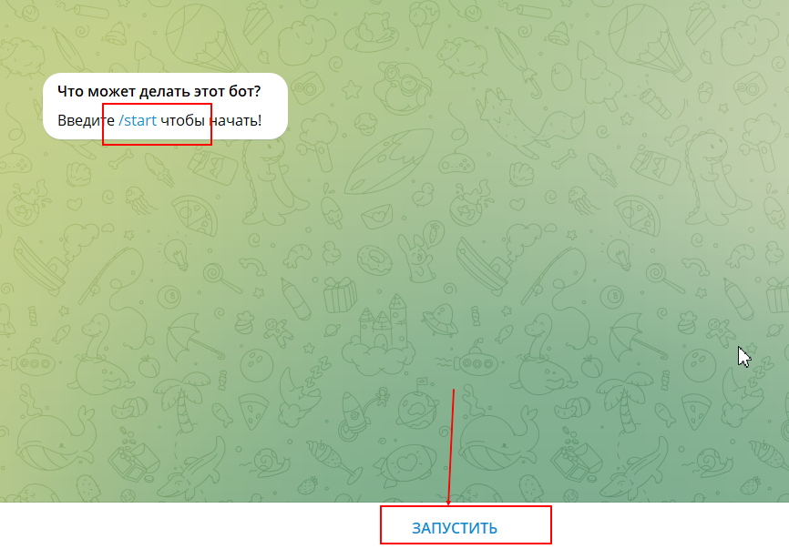
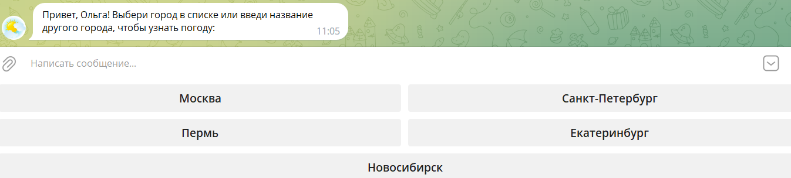

# Project 4 - REST API

***Цель: командой написать не только код, но и создать работающий телеграмм-бот.***

## I. Этапы работы и описание процесса работы телеграмм-бота
*	Выбрали API: <https://api.openweathermap.org>.

*	Написали класс взаимодействия с выбранным командой API, а в рамках класса методы взаимодействия с ним.

*	Создали телеграмм-бот «Прогноз погоды» на хостинге <pythonanywhere.com>.

*	Установили библиотеку TelegramBotAPI для взаимодействия с Телеграм.

*	Написали код на Python 3 для создания телеграмм бота. 

*	В начале файла указали токен бота, который до этого был получен через BotFather. На основе полученного токена создали экземпляр бота (bot).

*	Создали хэндлеры (обработчики), которые определяют взаимодействие бота и пользователя. Хэндлер '/start' реагирует на команду '/start' и отправляет пользователю приветственное сообщение. Хэндлеры, задействованные в func, обрабатывают текстовые сообщения.
В данном случае хэндлер обрабатывает любое текстовое сообщение, введенное пользователем. Внутри хэндлера формируется API-запрос, адресуется серверу openweathermap.org и получается информация о погоде. Далее извлекается интересующая информация и формируется текст ответного сообщения (Температура: °C; Влажность: %; Скорость ветра: м/с).

*	Бот выполняется в бесконечном цикле (polling), который опрашивает сервер на наличие запросов. Если запрос от пользователя поступает, бот обрабатывает запрос и возвращает ответное сообщение. Если пользователь не посылает запросы, бот находится в режиме ожидания.

## II.  Как можно проверить телеграмм-бот «Прогноз погоды»
Пользователю необходимо пройти по ссылке <https://t.me/weatherforecast6_bot>.

Через кнопку «Запустить» в нижней части панели, запустить команду '/start'.

После чего бот напишет сообщение: «Привет, «Имя пользователя»! Выбери город в списке или введи название другого города, чтобы узнать погоду:». 

На выбор предлагается 5 активных кнопок с городами: Москва, Пермь, Санкт-Петербург, Новосибирск либо ввести пользователю самостоятельно наименование любого другого города.

 
Если пользователь выберет один из предложенных городов «на кнопках», либо введет название города, то бот отправит ему информацию о погоде в интересующем его городе.

 
Если пользователь введет название несуществующего города, то бот отправит ему сообщение с текстом: «Пожалуйста, уточните название города или попробуйте позже».
